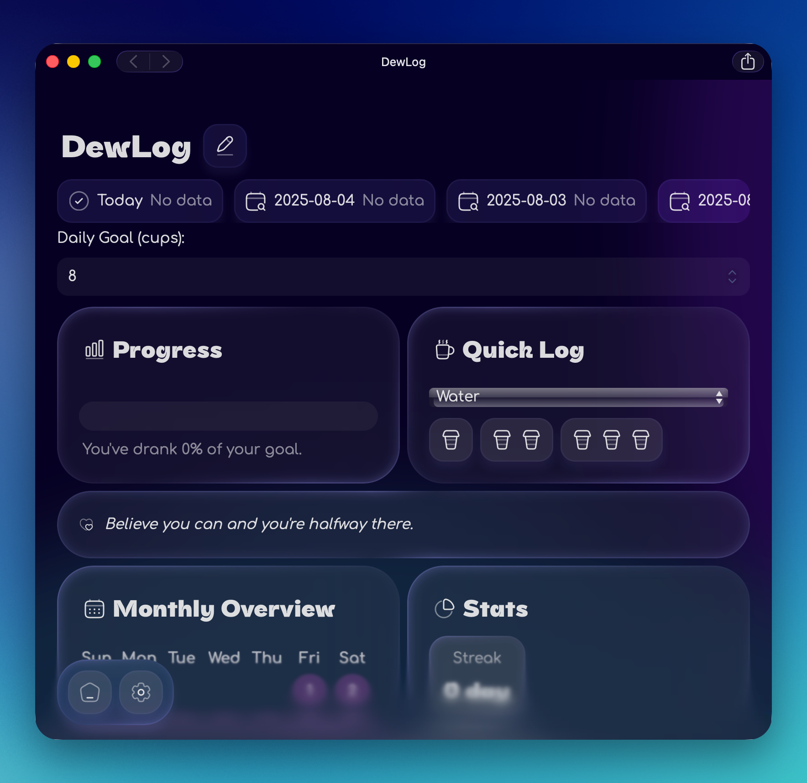

# DewLog
DewLog is a stylish and minimal hydration tracker built with [Vue 3](https://vuejs.org/) and [Vite](https://vitejs.dev/). Track your daily water intake, build streaks, and stay hydrated with a beautifully smooth interface.

## Features
- **Daily Tracking** - Easily log how many cups you’ve had today
- **Date Selector** - View and edit past hydration logs
- **Progress Goals** - Set your own daily goal and track your completion
- **Quick Log Buttons** - Log cups instantly with a single click
- **Monthly Overview** - Visual calendar showing your hydration streaks
- **Streak System** - Stay consistent and keep your streak going!
- **Motivational Quotes** - Get inspired to keep sipping 💜
